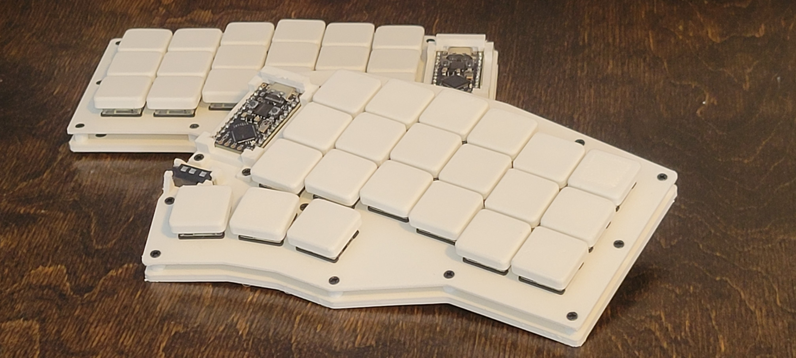
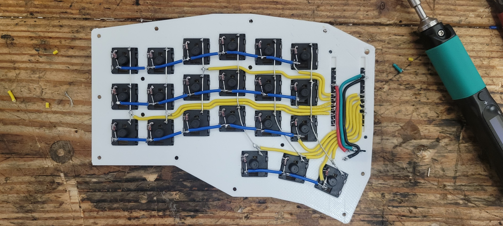

# corne_clone
A full custom clone of the corne keyboard (https://github.com/foostan/crkbd). All parts are 3d printed and hand-constructed. Electronics are powered by the RP2040 pro micro running QMK firmware, and everything is hand-wired.

## wiring

